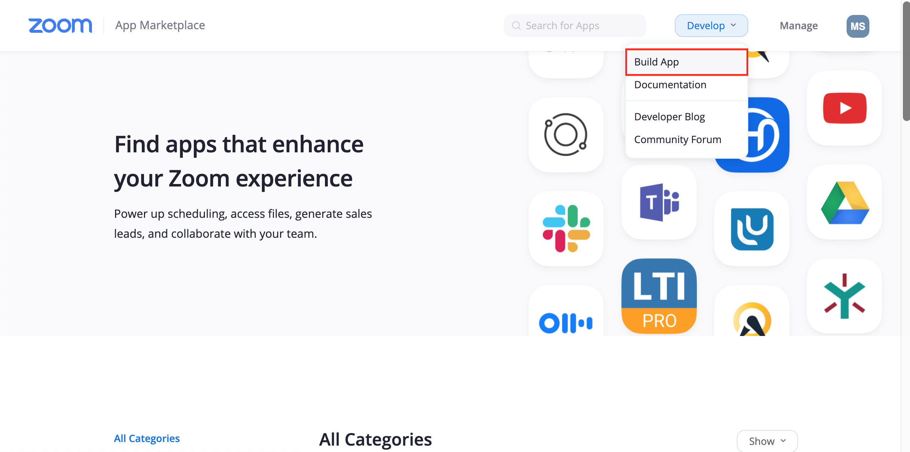
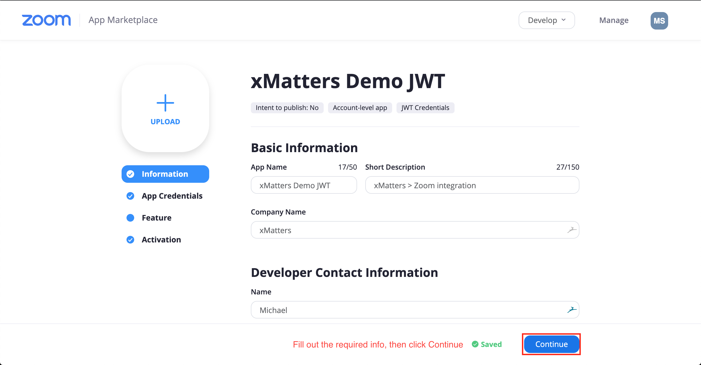
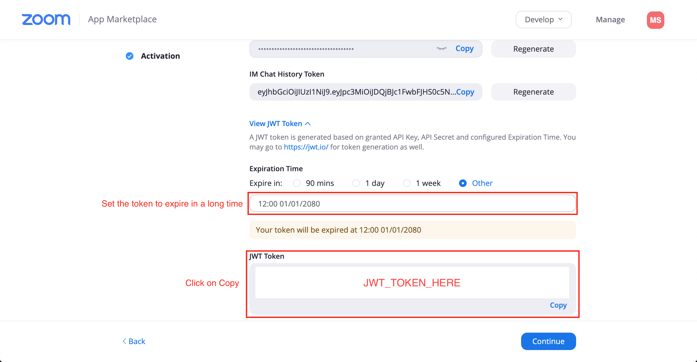
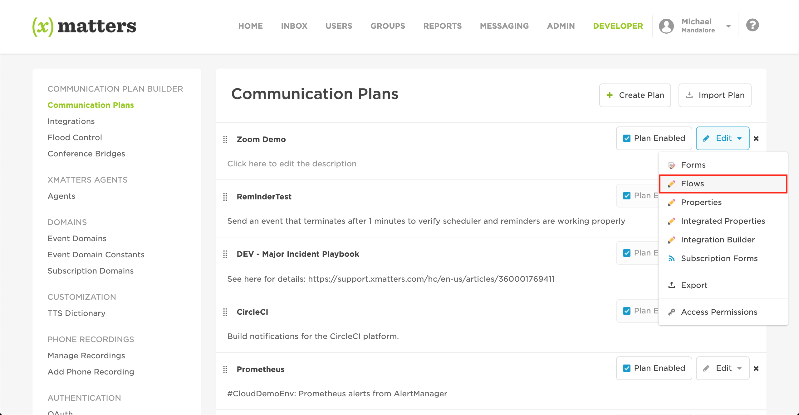
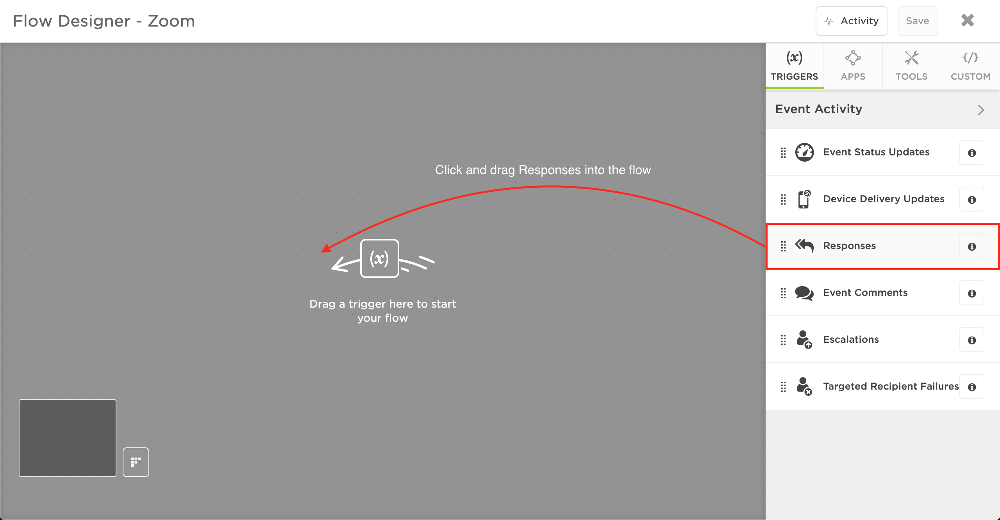

# Zoom Outbound (from xMatters) integration
This is part of the xMatters Labs awesome listing. For others, see [here](https://github.com/xmatters/xMatters-Labs).

With this library, notification recipients can quickly create a meeting in Zoom and use the outputted Join URL to invite others to the meeting.

This document details how to install and use this integration. 

---------

<kbd>

</kbd>

---------
# Pre-Requisites
* xMatters account - If you don't have one, [get one](https://www.xmatters.com)! 
* An xMatters Communication Plan
* Zoom account - If you don't have one, [get one](https://zoom.us/)!

# Files
* [zoom.js](./zoom.js) - This is the script to paste into the custom step, which creates the meeting and gets the URL

# Introduction - How it works
Zoom is a meeting solution known for its reliability and ease of use. This integration with xMatters makes it easy to create and invite people to join a Zoom meeting from an email, allowing anyone you give the link (with a password if you so choose) to join the meeting with just a click.

# Installation
## Prerequisites:
An existing Communication Plan in xMatters for which you would like to add a Zoom `Create a Meeting` response option

## Creating a Zoom Application
In order to create a Zoom meeting, you need to have an account-level marketplace app in Zoom that uses JWT Credentials, this will show you how to create one—if you already have one, skip this section but make sure to follow step (9) to create a JWT Token

1. Navigate to the [Zoom Marketplace](https://marketplace.zoom.us/) and log in with your Zoom account
2. Click on **Develop** > **Build App**

3. Give your app a name
4. Turn off the **Intend to publish this app on Zoom Marketplace** slider
5. Check the option for **Account-level app**, and choose **JWT API Credentials** as the credential option

6. Click **Create**
7. Fill out the basic information for the app, then click **Continue**

8. On the **App Credentials** page, open the **View JWT Token** dropdown, then select the **Other** option for `Expiration Time`, and fill in the date to be something a long time from now (for example: noon on January 1, 3000, i.e. `12:00 01/01/3000`)
* Note: This is not very secure, it is more advisable to use the **1 week** option, and then update the JWT Token value inside your flow in xMatters every week, but this can become cumbersome
9. Copy the **JWT Token** value and keep it on a notepad to add to xMatters later

## Adding Zoom to xMatters
1. Inside your xMatters instance, navigate to the Developer tab
2. Locate the Communication Plan you would like to add Zoom options to, then click **Edit** > **Integration Builder**

3. In the Integration Builder, click on **Edit Endpoints**

4. Click on **Add Endpoint**, name it `Zoom`, set the Base URL to `https://api.zoom.us/v2`, then click **Save Changes** and **Close**

5. Click on the **Forms** tab

6. For the Form you would like to add Zoom options to, click on **Edit** > **Responses**

7. Add a response option to create a meeting in Zoom, then click **Save Changes**

8. Use the breadcrumbs to return to the Communication Plan, then click **Flows**
9. For the form you just created the Zoom response option in, click **Create a flow**

10. Click and drag **Responses** into the flow, then click **Save**

11. On the righthand side, click on the **Custom** tab, then click **+ Create a custom action**

12. In the settings tab, fill out the info as follows, then click **Save**:

| Option                     | Value                                   |
| ---------------------- | ------------------------------- |
| Name                      | Create Zoom Meeting         |
| Description             | Creates a meeting in Zoom |
| Include Endpoint    | **✓**                                     |
| Endpoint Type        | Allow Any                             |
| Endpoint Label       | Zoom                                   |

13. In the inputs tab, add these five inputs, then click **Save**:

| Name | Required Field | Minimum Length | Maximum Length | Help Text | Default Value | Multiline |
| ------- | ---------------- | -------------------- | -------------------- | ----------- | --------------- | --------- |
| JWT Token | **✓** | 0 | 2000 | Zoom JWT Token |  |  |
| schedule_for | **✓** | 0 | 2000 | Email or Zoom User ID of host for meeting | You can add a default host here or leave it blank |  |
| topic | **✓** | 0 | 2000 | Topic of Zoom meeting |  |  |
| agenda |  | 0 | 2000 | Meeting description |  |  |
| password |  | 0 | 10 | Password to join the meeting. May only contain [a-z A-Z 0-9 @ - _ *]. Max of 10 characters | You can choose to put a default password here or leave it blank |  |
| enforce_login |  | 0 | 2000 | Whether or not user are required to be signed in to their Zoom account to join the meeting (Can be either True or False) | False |  | 
14. In the outputs tab, add two outputs, one named **Join URL**, and one named **Start URL**, then click **Save**
15. In the script tab, paste in [this](./script.js) script, then click **Save**
16. Now you've made your custom action, which you can reuse as much as you want, changing the `schedule_for` input to change who is the host, and using it for as many `topic`s as you would like (Note the `JWT Token` generally will not change)

## Adding the step to a flow
1. In your flow, click and drag the custom **Create Zoom Meeting** action into the flow

2. Connect your Zoom **Create a meeting** response option (or any other step that you would like to fire a Zoom meeting from!) to your custom **Create Zoom meeting** action in the flow

3. Double click the **Create Zoom meeting** custom step
4. Fill in the input values in the **Setup** tab, for example

| JWT Token | schedule_for | topic | agenda | password | enforce_login |
| --- | --- | --- | --- | --- | --- |
| [Long JWT Token you copy from Zoom] | example@email.com | meeting topic | meeting description | zoomzoom | False |

5. In the **Endpoint** tab, open the dropdown and select the **Zoom** Endpoint
6. Click OK to save the custom step, then click **Save** to save the flow
7. **TODO** Add another step that sends an email back to the user with the Join URL and Start URL 
