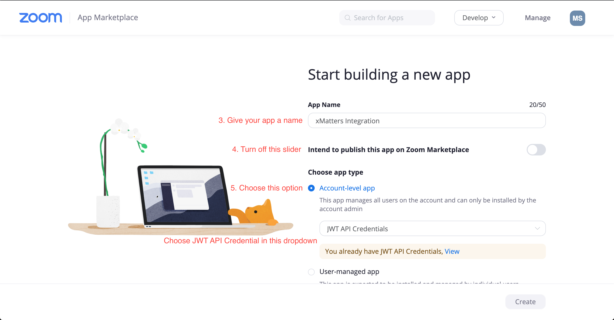
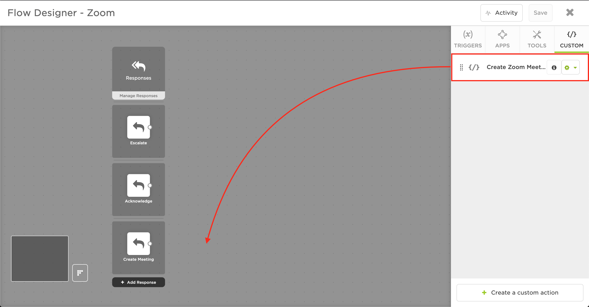
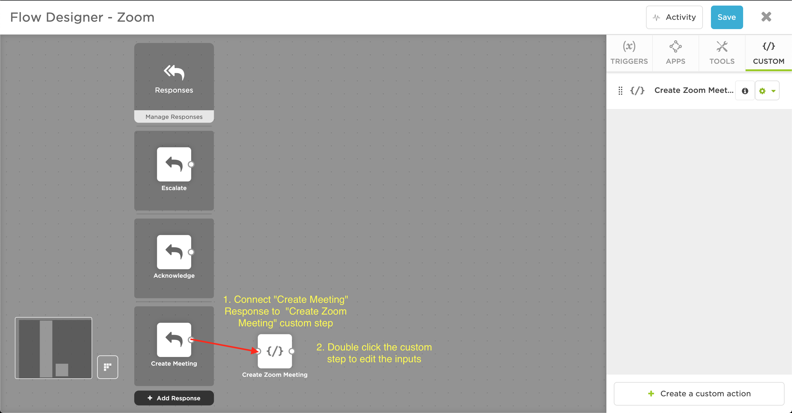
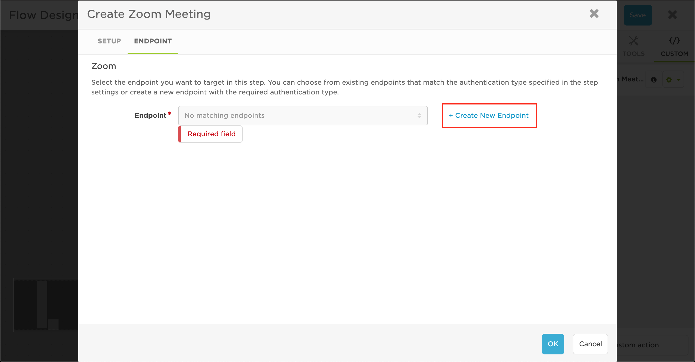

# Zoom Outbound (from xMatters) integration
This is part of the xMatters Labs Steps awesome listing. For others, see [here](https://github.com/xmatters/xMatters-Labs-Flow-Steps).

With this library, notification recipients can quickly create a meeting in Zoom and use the outputted Join URL to invite others to the meeting.

This document details how to install and use this integration. 

---------

<kbd>

</kbd>

---------
# Pre-Requisites
* xMatters account - If you don't have one, [get one](https://www.xmatters.com)! 
* An xMatters Communication Plan
* Zoom account - If you don't have one, [get one](https://zoom.us/)!

# Files
* [zoom.js](./zoom.js) - This is the script to paste into the custom step, which creates the meeting and gets the URL

# Introduction - How it works
Zoom is a meeting solution known for its reliability and ease of use. This integration with xMatters makes it easy to create and invite people to join a Zoom meeting from an email, allowing anyone you give the link (with a password if you so choose) to join the meeting with just a click.

# Installation
## Prerequisites:
An existing Communication Plan in xMatters for which you would like to add a Zoom `Create a Meeting` response option

## Zoom Setup
In order to create a Zoom meeting, you need to have an account-level marketplace app in Zoom that uses JWT Credentials, this will show you how to create one—if you already have one, skip this section but make sure to follow step (9) to create a JWT Token

1. Navigate to the [Zoom Marketplace](https://marketplace.zoom.us/) and log in with your Zoom account
2. Click on **Develop** > **Build App**

3. Give your app a name
4. Turn off the **Intend to publish this app on Zoom Marketplace** slider
5. Check the option for **Account-level app**, and choose **JWT API Credentials** as the credential option

6. Click **Create**
7. Fill out the basic information for the app, then click **Continue**

8. On the **App Credentials** page, open the **View JWT Token** dropdown, then select the **Other** option for `Expiration Time`, and fill in the date to be something a long time from now (for example: noon on January 1, 3000, i.e. `12:00 01/01/3000`)
* Note: This is not very secure, it is more advisable to use the **1 week** option, and then update the JWT Token value inside your flow in xMatters every week, but this can become cumbersome
9. Copy the **JWT Token** value and keep it on a notepad to add to xMatters later

## Create Meeting Step

### Settings

| Option                     | Value                                   |
| ---------------------- | ------------------------------- |
| Name                      | Create Zoom Meeting         |
| Description             | Creates a meeting in Zoom |
| Include Endpoint    | **✓**                                     |
| Endpoint Type        | Allow Any                             |
| Endpoint Label       | Zoom                                   |

### Inputs

| Name | Required Field | Minimum Length | Maximum Length | Help Text | Default Value | Multiline |
| ------- | ---------------- | -------------------- | -------------------- | ----------- | --------------- | --------- |
| JWT Token | **✓** | 0 | 2000 | Zoom JWT Token |  |  |
| schedule_for | **✓** | 0 | 2000 | Email or Zoom User ID of host for meeting | You can add a default host here or leave it blank |  |
| topic | **✓** | 0 | 2000 | Topic of Zoom meeting |  |  |
| agenda |  | 0 | 2000 | Meeting description |  |  |
| password |  | 0 | 10 | Password to join the meeting. May only contain [a-z A-Z 0-9 @ - _ *]. Max of 10 characters | You can choose to put a default password here or leave it blank |  |
| enforce_login |  | 0 | 2000 | Whether or not user are required to be signed in to their Zoom account to join the meeting (Can be either True or False) | False |  | 

### Outputs

| Name |
| --- |
| Join URL |
| Start URL |
| Save |

### Script

In the script tab, paste in this [script](./script.js)

## Usage
1. In your flow, click and drag the custom **Create Zoom Meeting** action into the flow

2. Connect your Zoom **Create a meeting** response option (or any other step that you would like to fire a Zoom meeting from!) to your custom **Create Zoom meeting** action in the flow

3. Double click the **Create Zoom meeting** custom step
4. Fill in the input values in the **Setup** tab, for example

| JWT Token | schedule_for | topic | agenda | password | enforce_login |
| --- | --- | --- | --- | --- | --- |
| [Long JWT Token you copy from Zoom] | example@email.com | meeting topic | meeting description | zoomzoom | False |

5. In the **Endpoint** tab, click **Create New Endpoint**

6. Fill in the endpoint with the following values, then click **Save Changes**

| Name | Base URL | Trust self-signed certficiates | Authentication Type |
| --- | --- | --- | --- |
| Zoom | https://api.zoom.us/v2 | | None |

7. Close out of the endpoint editor, then click OK to save the custom step, then click **Save** to save the flow

# Testing
To test the step, fire the xMatters outbound notifier and select the **Create Zoom Meeting** response option. If it works, the `Join URL` and `Start URL` will be populated with the Zoom meeting join link.
* To see the Join URL, edit the script for the custom step inside the Flow Designer, adding a line at the end with `console.log(output['Join URL'])`
* Now, when the **Create Zoom Meeting** response fires, you should be able to see the Join URL in the activity stream (access this by clicking on **Activity** inside the Flow Designer)

# Troubleshooting
If the step is not working properly, there are a few places where it could be going wrong.
## Zoom side
1. First, check to make sure you have the correct credentials. To do this, navigate to the [Zoom marketplace](https://marketplace.zoom.us/), log in with your account, then click on Manage
2. Click on your JWT app
3. Go to the App Credentials tab, and check that your API Key, API Secret, and JWT Token are the same as in xMatters

## xMatters side
1. Once you've made sure that your API Key, API Secret, and JWT Token match those in Zoom, check that you defined all the inputs and outputs correctly
2. If you have defined everything correctly, make sure you are using the outputs in the way you want to (for example—inside a Slack message)
3. If all of these are correctly defined, check the log for the Flow (by clicking on **Activity** inside the Flow Designer and selecting the Zoom step) for more guidance
